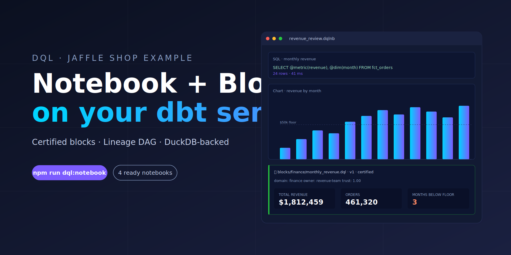

<h1 align="center">Jaffle Shop — DQL example</h1>

<p align="center">
  <em>A Hex-grade notebook + certified blocks + lineage, layered on the canonical Jaffle Shop.</em>
</p>

<p align="center">
  <a href="LICENSE"></a>
  <a href="https://www.npmjs.com/package/@duckcodeailabs/dql-cli"></a>
  <a href="https://www.getdbt.com/"></a>
  <a href="https://duckdb.org/"></a>
  <a href="https://github.com/dbt-labs/jaffle-shop"></a>
</p>

<p align="center">
  
</p>

> 📸 This hero is an illustrative SVG. For a live-screenshot version, run `npm run dql:notebook`, open `notebooks/revenue_review.dqlnb`, save a PNG into `docs/hero.png`, and swap the `src` above to `docs/hero.png`.

A complete, runnable example of [DQL](https://github.com/duckcode-ai/dql) on top of the canonical [Jaffle Shop](https://github.com/dbt-labs/jaffle-shop) dataset. Build it locally and you get:

- A DuckDB warehouse populated from the Jaffle Shop tap (3.5k customers, 461k orders, 740k order items)
- dbt models (staging + marts) as the semantic source of truth
- Three certified DQL blocks (`finance`, `customer`, `product`) with tests and owners
- Four notebooks demonstrating SQL, chart, pivot, filter, single-value, and bound-block cells — wired end-to-end to the marts
- A domain-organized semantic layer (metrics, dimensions, cubes) that notebooks can consume

## Quickstart

```bash
# 1. Install Python deps (dbt-duckdb)
pip install -r requirements.txt

# 2. Install Meltano and load the raw tables (~1 min)
pipx install meltano
meltano install
meltano run tap-jaffle-shop target-duckdb

# 3. Install dbt packages and build the warehouse
dbt deps
dbt build --profiles-dir .

# 4. Install the DQL CLI and open the notebook
npm install
npm run dql:notebook
```

The notebook opens on `http://localhost:5174`. Start with `notebooks/welcome.dqlnb` — it's a 5-minute tour.

## What's in the box

```
.
├── models/                  # dbt project (staging + marts)
├── semantic-layer/
│   ├── metrics/{finance,customer,product}/
│   ├── dimensions/{finance,customer,product}/
│   └── cubes/{finance,customer,product}/
├── blocks/
│   ├── finance/monthly_revenue.dql
│   ├── customer/customer_segments.dql
│   └── product/top_products.dql
└── notebooks/
    ├── welcome.dqlnb             # 7-cell tour
    ├── revenue_review.dqlnb      # finance monthly business review
    ├── customer_cohorts.dqlnb    # cohort retention analysis
    └── product_performance.dqlnb # top products + margin
```

## The notebooks

Each notebook answers a real recurring business question, with an intro explaining audience/cadence/source, followed by visual cells that all read from one upstream SQL dataframe, and a certified block bound at the bottom for the stable definition.

| Notebook | Owner | Question |
|---|---|---|
| `revenue_review.dqlnb` | finance | How much revenue did we book? Is the food/drink mix shifting? Which months missed the $50k floor? |
| `customer_cohorts.dqlnb` | growth | How large is each first-order cohort? Which ones returning at >60%? |
| `product_performance.dqlnb` | product | Top-10 products by revenue. Beverage vs jaffle margin split. Which products beat 80% gross margin? |

## Useful commands

```bash
npm run dql:doctor      # verify DuckDB + semantic layer connectivity
npm run dql:compile     # compile blocks + dashboards to runnable artifacts
npm run dql:lineage     # print the lineage graph (dbt models → blocks → notebooks)
npm run dql:validate    # governance lint on blocks
```

## Credits

Seeded from [dbt-labs/jaffle-shop](https://github.com/dbt-labs/jaffle-shop). DQL blocks, notebooks, semantic layer, and domain organization are new work by [DuckCode AI](https://github.com/duckcode-ai) and licensed under Apache 2.0 — see [LICENSE](LICENSE).
