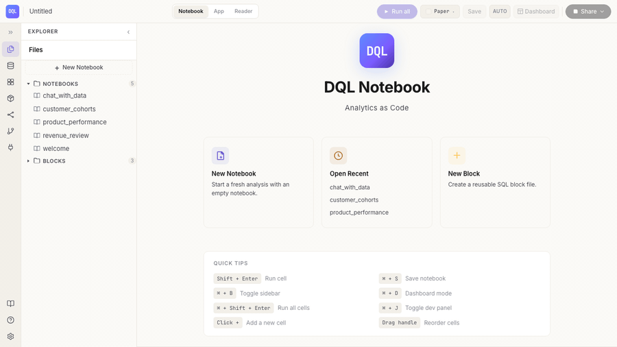
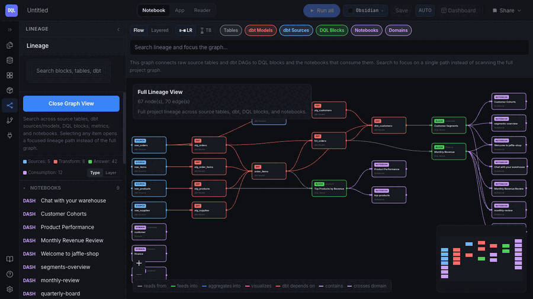

<h1 align="center">Jaffle Shop — DQL example</h1>

<p align="center">
  <em>A Hex-grade notebook, certified blocks, a CXO digest, and a Claude-powered chat cell — layered on the canonical Jaffle Shop.</em>
</p>

<p align="center">
  <a href="LICENSE"></a>
  <a href="https://www.npmjs.com/package/@duckcodeailabs/dql-cli"></a>
  <a href="https://www.getdbt.com/"></a>
  <a href="https://duckdb.org/"></a>
  <a href="https://github.com/dbt-labs/jaffle-shop"></a>
</p>

<p align="center">
  
</p>

A complete, runnable example of [DQL](https://github.com/duckcode-ai/dql) on top of the canonical [Jaffle Shop](https://github.com/dbt-labs/jaffle-shop) dataset. Build it locally and you get:

- A **DuckDB warehouse** populated from the Jaffle Shop tap — 3.5k customers, 461k orders, 740k order items
- **dbt models** (staging + marts) as the semantic source of truth
- Three **certified DQL blocks** (`finance`, `customer`, `product`) with tests, owners, and agent-facing `llmContext`
- Four **notebooks** — SQL, chart, pivot, filter, single-value, bound-block, and the new **chat cell**
- A domain-organized **semantic layer** (metrics, dimensions, cubes) that notebooks and the agent consume
- Three **first-class Apps** (`finance-cxo`, `customer-success`, `product-team`) with members, roles, access policies, RLS bindings, and weekly schedules — plus the legacy `q4_finance.dql-app`

## Showcase

**Apps + persona switching** — open an App, click the persona switcher,
preview the dashboard as any member. Regional leads carry RLS-narrowing
attributes that flow into block execution at query time.

<p></p>

**Block Library with certified flags** — every block shows its
certification status inline. The agent's block-first answer loop only
matches blocks with `status: certified`.

<p></p>

**Full-stack lineage** — `Domain → App → Dashboard → Block → metric → dbt model → source`,
rendered as an interactive React Flow + dagre graph. 67 nodes, 70 edges
in this project.

<p></p>

**Chat with your warehouse** — agent-grounded notebook with a chat cell
that runs every answer through the same governance gate as `Save as Block`.

<p></p>

## Quickstart

Two paths. **Pick one.**

### Option A — Docker (recommended) · 60 seconds

The fastest way. No Python, Node, meltano, or dbt to install — the image
bundles everything.

```bash
git clone https://github.com/duckcode-ai/jaffle-shop-dql.git
cd jaffle-shop-dql
docker compose up
```

> First run takes ~3–5 minutes (image build + meltano + dbt seeding).
> The 118 MB DuckDB warehouse lands in the bind-mounted directory and is
> reused on every subsequent start.

The notebook opens on **http://127.0.0.1:3474**. Start with
`notebooks/welcome.dqlnb` — a 5-minute tour.

To force a fresh seed:
```bash
docker compose down -v && rm -f jaffle_shop.duckdb && docker compose up
```

To run a local LLM alongside the notebook:
```bash
docker compose --profile ollama up
```

### Option B — Native install (Python + Node) · 5 minutes

| Tool | Version | Why |
|---|---|---|
| Node.js | `≥ 20` | DQL CLI is an npm package |
| Python | `≥ 3.10` | dbt-duckdb + meltano |
| DuckDB | bundled | comes in with dbt-duckdb |
| Anthropic / OpenAI / Gemini key *or* local Ollama | optional | only for the chat cell / `dql agent` |

```bash
# 1. Python deps (dbt-duckdb)
pip install -r requirements.txt

# 2. Meltano: load raw tables from the Jaffle Shop tap (~1 min)
pipx install meltano
meltano install
meltano run tap-jaffle-shop target-duckdb

# 3. dbt: build the warehouse
dbt deps
dbt build --profiles-dir .

# 4. DQL CLI + open the notebook
npm install
npm run dql:notebook
```

The notebook opens on `http://127.0.0.1:3474`.

> **Prefer a minimal starter?** `npx create-dql-app my-proj` scaffolds a
> small example elsewhere. This repo is the full worked example — dbt +
> semantic layer + certified blocks + App + digest + agentic chat cell.

## What's in the box

```
.
├── apps/
│   └── q4_finance.dql-app/       # Domain-scoped bundle (v1.2 App artifact)
│       ├── app.yml               # Manifest (owner, consumers, cadence, entryPoints)
│       ├── digest.dql            # Scheduled CXO digest — narrative + chart, SHA-cited
│       └── notebooks/overview.dqlnb
├── blocks/
│   ├── finance/monthly_revenue.dql     # Certified + llmContext + invariants + examples
│   ├── customer/customer_segments.dql
│   └── product/top_products.dql
├── models/                        # dbt (staging + marts)
├── notebooks/
│   ├── welcome.dqlnb              # 7-cell tour — SQL, chart, KPI, bound block
│   ├── revenue_review.dqlnb       # Finance monthly business review
│   ├── customer_cohorts.dqlnb     # Cohort retention
│   ├── product_performance.dqlnb  # Top products + margin
│   └── chat_with_data.dqlnb       # Chat cell — BYOK agent grounded in the semantic layer
└── semantic-layer/
    ├── metrics/{finance,customer,product}/
    ├── dimensions/{finance,customer,product}/
    └── cubes/{finance,customer,product}/
```

## The notebooks

Each answers a real recurring business question. Every cell in the notebook reads from one upstream SQL dataframe; a certified block is bound at the bottom for the stable definition.

| Notebook | Owner | Question |
|---|---|---|
| `welcome.dqlnb` | data-team | Feature tour: SQL → chart → KPI → bound block |
| `revenue_review.dqlnb` | finance | How much revenue did we book? Food vs drink mix? Months below the $50k floor? |
| `customer_cohorts.dqlnb` | growth | Cohort size and return rate per first-order month |
| `product_performance.dqlnb` | product | Top-10 revenue + gross margin, beverage vs jaffle split |
| `chat_with_data.dqlnb` | data-team | BYOK chat cell — propose a new block grounded in existing metrics |

## What's new in v1.2 (demonstrated here)

| Feature | Where it lives in this repo |
|---|---|
| **App artifact** — domain-scoped bundle with manifest + lineage node | `apps/q4_finance.dql-app/` |
| **CXO daily digest** — scheduled narrative + chart, every numeric claim stamped with a block SHA | `apps/q4_finance.dql-app/digest.dql` |
| **Chat cell** — BYOK Anthropic or Claude Code; agent proposes blocks through the governance gate | `notebooks/chat_with_data.dqlnb` |
| **Agent-facing block metadata** — `llmContext`, `examples`, `invariants` | `blocks/finance/monthly_revenue.dql` |
| **Local scheduler** — `dql schedule start|stop|list|run` | `npm run dql:schedule:*` |
| **MCP server** — expose DQL to Claude Code / Cursor / any MCP client | `npm run dql:mcp` |
| **Canonical format + `dql diff`** — diff-friendly `.dql` / `.dqlnb` serialization | `npm run dql:fmt:check` |

## Agentic path — chat cell + MCP

### Option A: chat cell (BYOK Anthropic API)

Put your key in `~/.dql/credentials`:

```toml
anthropic = "sk-ant-..."
```

or export `ANTHROPIC_API_KEY`. Open `notebooks/chat_with_data.dqlnb`. The agent grounds on the semantic layer and certified blocks, and ends each turn with a **block proposal** that routes through the same governance gate as *Save as Block* — missing owner/domain/description → red pills, fill them, Save.

### Option B: Claude Code provider

`brew install claude` (or equivalent). The chat cell spawns `claude` in headless stream mode — no API key needed. Same grounding, same proposal flow.

### Option C: external MCP client

Run the same tool surface from Claude Code, Cursor, Claude Desktop, etc.

```bash
# Claude Code
claude mcp add dql -- dql mcp

# Cursor — ~/.cursor/mcp.json
{
  "mcpServers": {
    "dql": { "command": "dql", "args": ["mcp"] }
  }
}
```

Exposed tools: `search_blocks`, `get_block`, `query_via_block`, `list_metrics`, `list_dimensions`, `lineage_impact`, `certify`, `suggest_block`. Only `query_via_block` runs SQL, and only through a certified block — never raw.

## Scheduler + CXO digest

```bash
# Start the scheduler in a separate shell (foreground daemon with pidfile)
npm run dql:schedule:start

# In another shell
npm run dql:schedule:list                     # show every scheduled block
dql schedule run "Q4 Finance Daily Digest"    # fire the digest once

# Stop cleanly
npm run dql:schedule:stop
```

The digest (`apps/q4_finance.dql-app/digest.dql`) compiles to HTML + markdown. Every numeric claim in the narrative is stamped with its source block's git SHA (`blocks/finance/monthly_revenue.dql@<sha>`) so the answer is reproducible at that exact commit forever. SMTP is BYO — set `DQL_SMTP_URL` or the notifier reports `delivered: false` with a clear reason.

## Useful commands

```bash
npm run dql:doctor         # verify DuckDB + semantic layer connectivity
npm run dql:validate       # governance lint on blocks
npm run dql:compile        # compile blocks + dashboards + digest to runnable artifacts
npm run dql:lineage        # dbt models → blocks → notebooks → apps → digest
npm run dql:fmt            # canonicalize .dql / .dqlnb files (diff-friendly)
npm run dql:fmt:check      # CI gate
npm run dql:app:ls         # list apps in this project
npm run dql:app:show       # show the q4-finance app manifest
npm run dql:mcp            # start the MCP server (stdio by default)
```

## Troubleshooting

| Symptom | Fix |
|---|---|
| `dql: command not found` | Ran `npm install`? The CLI is pinned in `package.json`. Use `npx dql` or the `npm run dql:*` scripts. |
| `schema introspection failed (500)` banner | Warehouse isn't up or lock file is held. Check `jaffle_shop.duckdb` exists and no other process is writing to it. |
| Chat cell shows "set `ANTHROPIC_API_KEY`" | Expected — see [Agentic path](#agentic-path--chat-cell--mcp). |
| `dql schedule start` says "already running" | Stale pidfile. `rm .dql/schedule.pid` or `kill $(cat .dql/schedule.pid)`. |
| Notebook looks old after `npm update` | The CLI ships the UI bundle; `npm i -g @duckcodeailabs/dql-cli@latest` to refresh. |

## Support

- **DQL issues / feature requests** — [github.com/duckcode-ai/dql/issues](https://github.com/duckcode-ai/dql/issues)
- **Example-repo issues** — [github.com/duckcode-ai/jaffle-shop-dql/issues](https://github.com/duckcode-ai/jaffle-shop-dql/issues)
- **Docs** — in the main repo under `docs/`
- **DQL CLI on npm** — [@duckcodeailabs/dql-cli](https://www.npmjs.com/package/@duckcodeailabs/dql-cli)

## Credits

Seeded from [dbt-labs/jaffle-shop](https://github.com/dbt-labs/jaffle-shop). DQL blocks, notebooks, semantic layer, the Q4 Finance app, and the chat-cell example are new work by [DuckCode AI](https://github.com/duckcode-ai) and licensed under Apache 2.0 — see [LICENSE](LICENSE).
